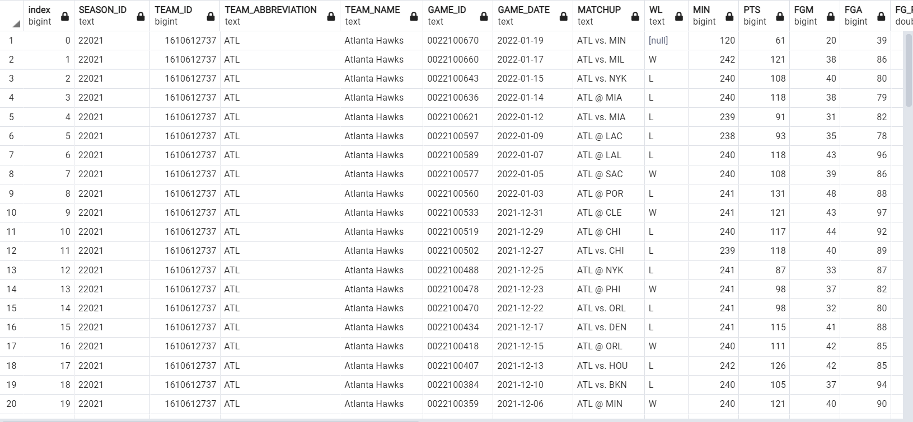
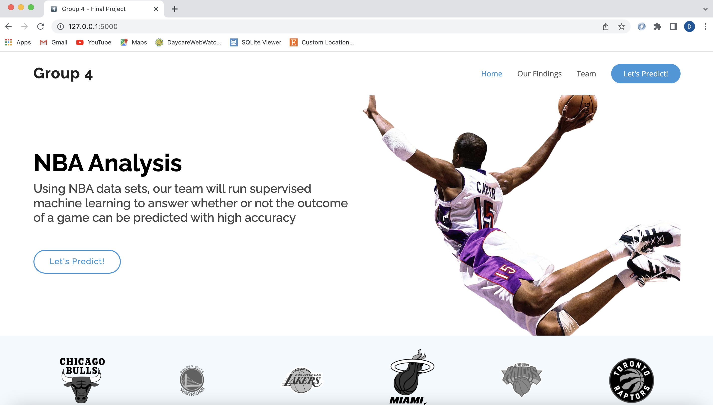
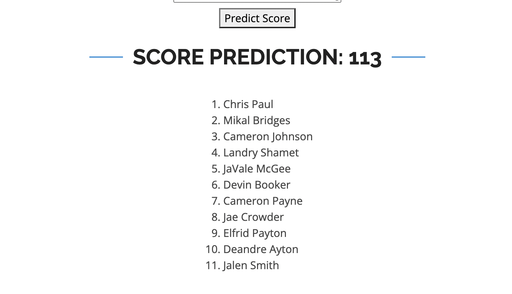
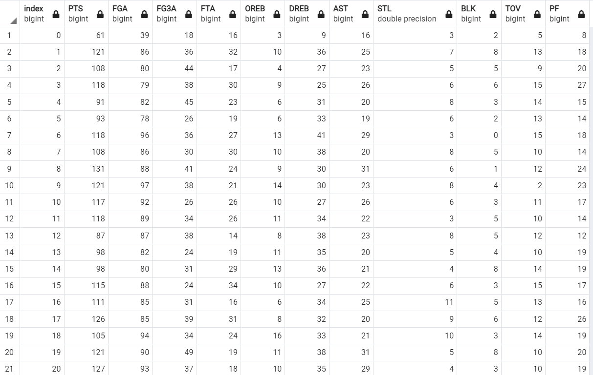
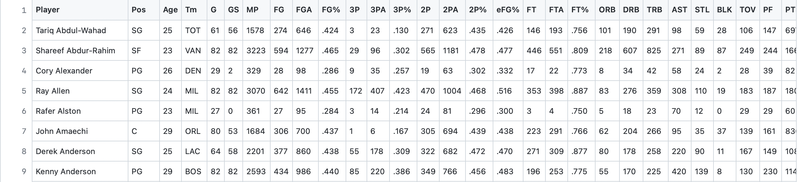

<h1 align="center">NBA Analysis</h1>

## Purpose
Using NBA data sets, our team will run supervised machine learning to answer whether or not the outcome of a game can be predicted with high accuracy.

## Resources
- Data Source: https://www.nba.com/, https://www.basketball-reference.com/

## Technologies
To transform our data, build our machine learning model (including importing different libraries) and store our data we will be using the following:
- Python 3.9.6
- Conda 4.10.3
- Jupyter-Notebook 6.3.0
- Pandas 1.2.4 
- Scikit-learn 1.0.1
- PostgreSQL 14.0
- pgAdmin 4 5.7

To prepare our presentation of our final results we will be building a website to display our findings. This will require the use of:
- Javascript 1.7
- CSS/Bootstrap 4.0.0
- HTML 5
- Leaflet 1.7.1, D3.js v5

## Topic Overview

**Reasons we selected topic:**
- Large dataset available
- Hobby or interest in the sport 
- Famous sport across North America
- If we predict game outcomes with high accuracy we could profit from gambling

**Description of the Data**

There exists an abundance of data collected on players and teams in the NBA. All data used can be located in the data folder.

**Questions we hope to answer by analyzing the data** 

1. Will we be able to predict the outcome of a game based on a team's roster and player statistics?
2. Will certain player statistics be less or more important towards the accuracy of our prediction?
3. Does including more years worth of player statistics help to better predict our outcome, versus just looking at the last season?

**Group Members & Roles**
- Danny Abouchakra (data etl, and machine learning)
- Danielle Di Gioacchino (front end development)
- Shantanu Vaidya (database manager)
- Keshav Gupta (group organizer, and administrator)

## Dashboard 

We decided we wanted to have our interactive model displayed through a webpage powered by Flask. We were able to connect our prediction model to our website and have a functioning button labelled "Predict Score". Users can interact with our website, by first selecting a team, second selecting a list of players and finally predicting the outcome score of the game.

## Provisional Machine Learning Model 
Our framework for the data:

Game Statistics 

Player Statistics 

Our goal is to use a linear regression model to predict the outcome of game based on roster, and player statistical history. We will train the model with past game data. We may have to train and test multiple models to try and find what gives us higher accuracy with this type of data.

Inputs into our Model: 
- Team field goal attempts
- Team 3-point field goal attempts
- Team free throw attempts
- Team offensive rebounds
- Team defensive rebounds
- Team assists
- Team steals
- Team blocks
- Team turnovers
- Team personal fouls

Output: 
- Total points scored

## Database

We used SQL to import our data into tables, since we had multiple csv files we are working with.

## Coding and Project Outline

## Data collection
Data has been collected using the web scraping technique. The website used to scrape data is www.basketball-reference.com. We are collecting the data of all the teams playing basketball and all their players.

## Data Cleaning
Once the data was collected, we started cleaning the data by dropping rows and columns which we do not require to analyze or represent the data. 

For example, we only need the data after 2016 for players so we run a loop to save only that data. Similarly, we collected the data for the 30 teams playing in NBA and the rest of the data was dropped. We converted all the data to numeric form which was previously in object form. Collected data which is in dictionary form is put in panda's dataframe so that it is easier to understand and analyse data.

# DataBase Integration

The raw dataset was converted to dataframe and was exported to SQL Database using SQLAlchemy. We used SQL as it is convenient to store, retrieve large amount of data from database and easy to connect to pandas. Since we wanted to keep all the raw data, we created different tables and populated with creating databse engine connection. We created separate tables in our database which we used as our input data for our supervised machine learning model. 

## Data Prediction with Machine Learning

We considered data from last 10 years and data had individual game statistics. The model we went with was multiple linear model as it uses several explanatory variables to predict the outcome. The feature selection and engineering when came to the players statistics was based on the data we got from each game. For the training data we used scikit learn model (train test split), so we used that to test the model. We also tried a few prediction models such as random forest regression and multiple linear regression model. We knew based on data and what we are trying to predict we were looking for linear correlation. We are not classifying data and we knew it was supervised learning, so we started testing some of the model and got similar results.

# Prediction Outcome

Before prediction we average out the team stats to 240 minutes a game. Then we tried multiple prediction models and after checking each of their accuracy and time taken to predict we narrowed it down to multiple linear regression model, which gave us an accuracy of 65%.

To present our findings, we used JavaScript, Flask and HTML. We built an interactive webpage by connecting our model.

[Link to Google Slides](https://docs.google.com/presentation/d/1X7IbXNPzlMzLPIEUK1mHQ7Bocg6VvR_WoTUrzYmuRhA/edit?usp=sharing)

